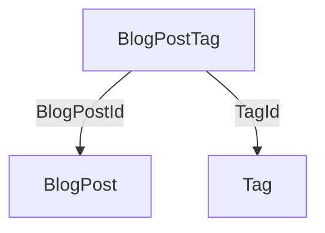
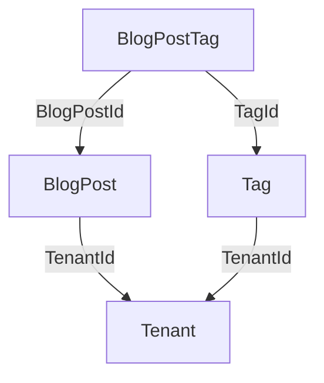
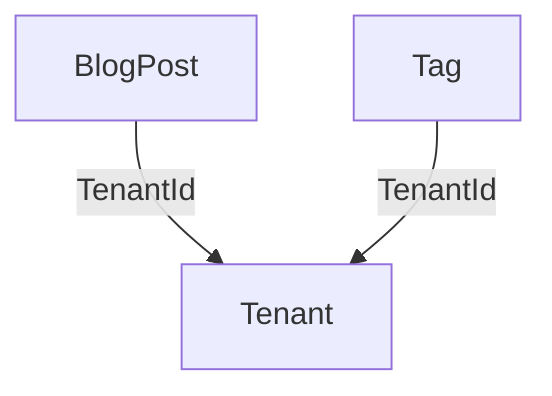

# Many-to-Many

A many-to-many relationship is a symmetrical way to link records in two tables, using a third [associative](https://en.wikipedia.org/wiki/Associative_entity) table to store the links.

```yaml
BlogPost:
    id:
        Id: [int]
    columns:
        Text: [string]

Tag:
    id:
        Id: [int]
    columns:
        Name: [string]

BlogPostTag:
    columns:
        BlogBostId: [BlogPost]
        TagId: [Tag]
```



In many simple schemas, if a query directly depends on columns from `Blog` and `Tag`, the only way to connect them into a system of joins is via `BlogPostTag`, so FlowerBI will automatically form the correct constraints and you don't have to tell it anything else.

But suppose this was a multi-tenant design and you need to keep all information segregated by tenant:

```yaml
Tenant:
    id:
        Id: [int]
    columns:
        Name: [string]

BlogPost:
    id:
        Id: [int]
    columns:
        TenantId: [Tenant]
        Text: [string]

Tag:
    id:
        Id: [int]
    columns:
        TenantId: [Tenant]
        Name: [string]

BlogPostTag:
    columns:
        BlogBostId: [BlogPost]
        TagId: [Tag]
```

Now `BlogPostTag` and `Tenant` are equally capable of connecting `BlogPost` and `Tag` together:



But if `Tenant` is also directly required by the query (which is almost certainly true, as every query is going to specify the `Tenant` in a filter to avoid cross-tenant leaks), then FlowerBI will conclude that it doesn't need to include `BlogPostTag` to complete the join system:



The effective result will be an unconstrainted cartesian product (cross join) of all `BlogPost`s with all `Tag`s in the same `Tenant`. That is, if the tenant has 100 posts and 20 tags, there will be 2000 combinations, as if every `BlogPost` was tagged with every `Tag`.

But all is not lost. If we add the `associative` hint to `BlogPostTag`:

```yaml
BlogPostTag:    
    columns:
        BlogBostId: [BlogPost]
        TagId: [Tag]
    associative: [BlogBostId, TagId]
```

After it eliminates any unnecessary tables, FlowerBI will look for any tables with at least two `associative` columns that point tables already included in the join system. This tells `FlowerBI` that the table must not be eliminated.

